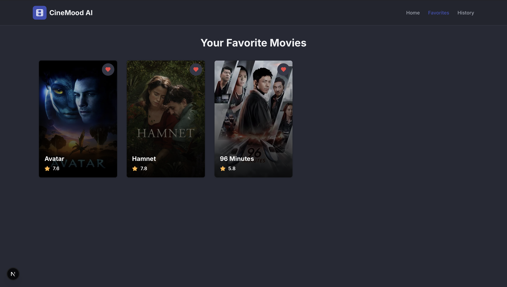
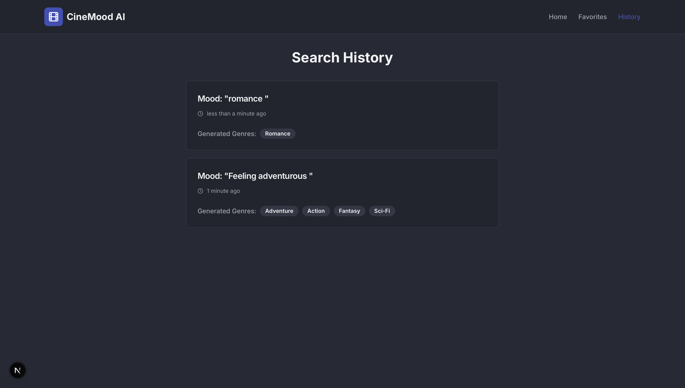

# CineMood AI 🎬🤖

**Your personal mood-based movie recommender.**

CineMood AI uses the power of Google's Gemini Flash 2.5 (via Genkit) to understand your current mood or situation and recommend the perfect list of movies for you. Whether you're feeling adventurous, heartbroken, or just want a cozy night in, CineMood AI has you covered.

## ✨ Features

- **Mood-to-Genre Analysis**: Type in *any* feeling (e.g., "I just broke up and want to cry" or "It's Friday night and I want high energy"), and our AI translates it into a curated list of movie genres.
- **Smart Recommendations**: Fetches top-rated movies matching those genres from The Movie Database (TMDB).
- **Favorites List**: Save movies you want to watch later.
- **Search History**: revisit your past moods and recommendations.
- **Responsive Design**: Built with a mobile-first approach using Tailwind CSS and shadcn/ui.

## 📸 Screenshots

### Home & Mood Input


### AI Recommendations


### Favorites & History



## 🛠️ Tech Stack

- **Framework**: [Next.js 15](https://nextjs.org/) (App Router)
- **Styling**: [Tailwind CSS](https://tailwindcss.com/)
- **UI Components**: [shadcn/ui](https://ui.shadcn.com/)
- **AI Engine**: [Google Genkit](https://firebase.google.com/docs/genkit) (Gemini 2.5 Flash)
- **Data Source**: [The Movie Database (TMDB) API](https://www.themoviedb.org/)
- **Deployment**: Configured for [Firebase App Hosting](https://firebase.google.com/docs/app-hosting)

## 🚀 Getting Started

### Prerequisites

- Node.js 18+ installed.
- A Google AI Studio API Key (for Gemini).
- A TMDB API Key (for movie data).

### Installation

1.  **Clone the repository:**
    ```bash
    git clone https://github.com/your-username/cinemood-ai.git
    cd cinemood-ai
    ```

2.  **Install dependencies:**
    ```bash
    npm install
    ```

3.  **Set up environment variables:**
    Create a `.env.local` file in the root directory and add your keys:
    ```env
    # Google AI (Gemini)
    GOOGLE_GENAI_API_KEY=your_google_ai_key_here

    # The Movie Database (TMDB)
    TMDB_API_KEY=your_tmdb_api_key_here
    ```

4.  **Run the development server:**
    ```bash
    npm run dev
    ```

5.  Open [http://localhost:3000](http://localhost:3000) in your browser.

## 📂 Project Structure

- `src/ai`: Contains Genkit flows and AI logic.
- `src/app`: Next.js App Router pages and API routes.
- `src/components`: React components (UI and feature-specific).
- `src/lib`: Helper functions and types.

## 🤝 Contributing

Contributions are welcome! Please feel free to submit a Pull Request.

## 📄 License

This project is open source and available under the [MIT License](LICENSE).
